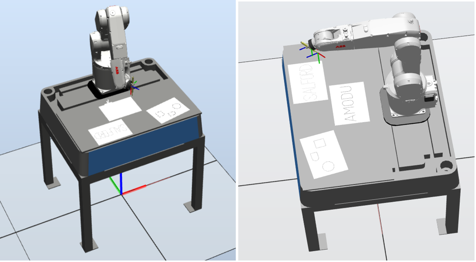
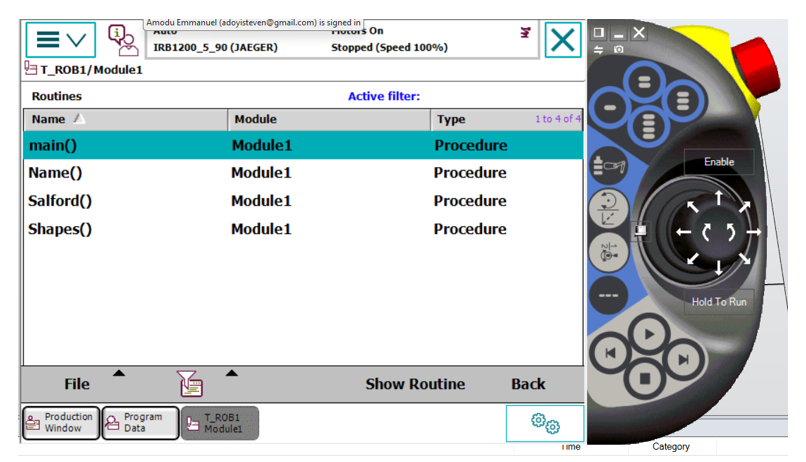
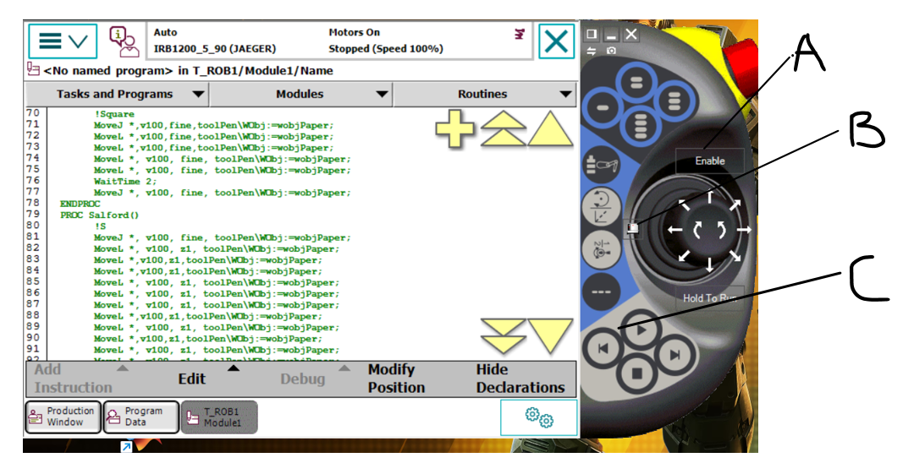

# ABB-ROBOTICS-PROGRAMMING.

 ### [YouTube Demonstration](https://www.youtube.com/watch?v=nK9CvXnekrM)

<h2>Description</h2> This project involves programming an ABB IRB 1200 industrial robot to perform automated drawing tasks using ABB's RobotStudio simulation software. The robot was programmed to draw geometric shapes (dodecagon, nonagon, square) and write text ("SALFORD" and "AMODU") on multiple workpieces using a pen tool attached to the end effector.  <h2>Languages and Utilities Used</h2>

<b>RAPID</b> (ABB's proprietary robotics programming language)

<b>RobotStudio</b>

<b>FlexPendant Interface</b>

<h2>Environments Used </h2>

<b>ABB RobotStudio 6.04.00.01</b>

<b>IRB 1200 5kg/0.9m Robot</b>

<b>SolidWorks</b> (for CAD components)

<h2>Project Setup and Results</h2>

 
Program Guide:   
 
 
 

Program Setup:   

 
 

Program Sample:   

<h2>Key Features</h2>
<b>Modular Programming</b>: Separate routines for shapes, text, and names

<b>Precision Control</b>: Implemented zone data (Fine, Z0, Z1) for accurate path following

<b>Multiple Motion Types</b>: Utilized Move J, Move L, and Move C commands appropriately

<b>Tool & Work Object Setup</b>: Proper configuration of TCP and coordinate systems

<b>User Interface</b>: Interactive program selection on FlexPendant

<h2>Skills Demonstrated</h2>
Industrial robot programming and simulation

Path planning and motion control

Coordinate system management

Offline programming with RobotStudio

Robotic cell setup and calibration

   
